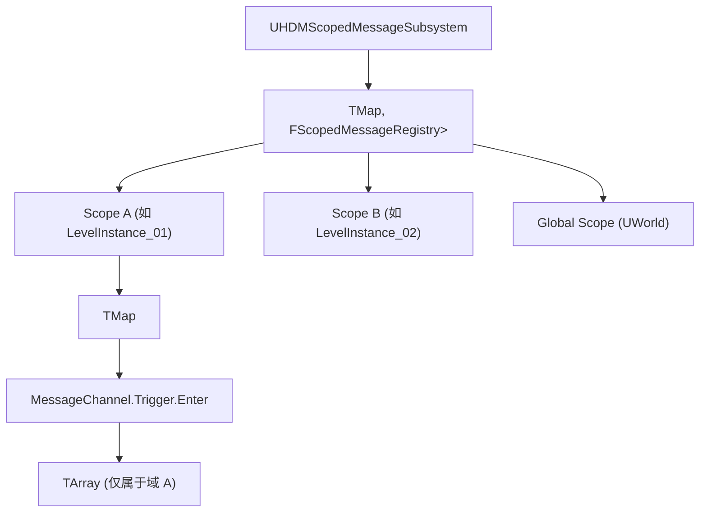

# 局域作用域消息系统 (Scoped Gameplay Message System) 技术设计方案

在大型虚幻引擎项目中，尤其是面对**多 POI 实例**、**随机关卡拼接**或**分层架构联动**场景时，全局广播机制（Pub/Sub）会导致非必要的消息分发开销，且需要每个接收端手动编写 `POIPlacementId` 的判定逻辑。

本方案旨在设计一个**局域作用域消息系统 (Scoped Message System)**，通过在消息层引入“作用域上下文 (Scope Context)”，实现局部事件的零判定自动隔离派发。

---

## 1. 核心设计思想

### 1.1 作用域上下文 (Scope Context)
每一个消息流（广播、监听）都绑定在一个特定的虚幻对象实例（`UObject`）上，这个对象就是 **Scope Context**。
* **局部作用域**：以关卡实例（`ULevelInstance`）、POI 根节点（`AHDMPOIRootActor`）或特定容器（`AActor`）作为 Scope 键。
* **全局作用域**：当 Scope 为空或特指 `UWorld` 时，降级为全局广播（保持对原有 GameplayMessage 的 100% 兼容）。

### 1.2 自动 Scope 追溯 (Zero-Code Context)
大多数情况下，策划在蓝图中不希望手动拖入 `Scope` 引用。系统支持**无侵入式自动追溯**：
当传入的 Scope 为空时，系统自动调用追溯算法：
`调用者 Actor` ➔ 向上寻找 `AHDMPOIRootActor`（或所属 `ULevelInstance`） ➔ 将其作为实际的 `ScopeContext`。

---

## 2. 系统架构设计

### 2.1 内存路由模型
Subsystem 内部不再是一维的 `Tag -> Listener` 映射，而是建立一个以 `Scope` 的**弱引用**为第一级键的双层映射表，确保在 Scope 对象（如动态关卡卸载）销毁时，其绑定的所有监听器自动安全释放：



---

## 3. C++ 接口设计与核心实现

### 3.1 Subsystem 核心接口

```cpp
#pragma once

#include "CoreMinimal.h"
#include "GameplayTagContainer.h"
#include "Subsystems/GameInstanceSubsystem.h"
#include "HDMScopedMessageSubsystem.generated.h"

USTRUCT(BlueprintType)
FHDMScopedMessageHandle
{
    GENERATED_BODY()
public:
    TWeakObjectPtr<UObject> RegisteredScope;
    FGameplayTag ChannelTag;
    int32 ListenerId = 0;
};

UCLASS(DisplayName = "HDM Scoped Message Subsystem")
class UHDMScopedMessageSubsystem : public UGameInstanceSubsystem
{
    GENERATED_BODY()

public:
    /**
     * 向指定 Scope 域广播消息
     * @param Channel          消息频道
     * @param Message          载荷结构体
     * @param ScopeContext     限制的作用域；若为空，则自动向上回溯所属关卡/POI
     */
    template <typename FMessageStruct>
    void BroadcastMessage(FGameplayTag Channel, const FMessageStruct& Message, UObject* ScopeContext = nullptr);

    /**
     * 订阅指定 Scope 域的消息
     * @param Channel          订阅的频道
     * @param Callback         回调委托
     * @param ScopeContext     订阅的作用域；若为空，则自动追溯绑定
     */
    template <typename FMessageStruct>
    FHDMScopedMessageHandle SubscribeMessage(FGameplayTag Channel, TFunction<void(FGameplayTag, const FMessageStruct&)> Callback, UObject* ScopeContext = nullptr);

    /** 注销订阅 */
    void Unsubscribe(FHDMScopedMessageHandle Handle);

private:
    UObject* ResolveDefaultScopeContext(UObject* QuerySource);
};
```

### 3.2 自动追溯算法 (Context Resolution)

当系统试图识别一个 Actor 默认所处的局域网域时，执行以下解析：

```cpp
UObject* UHDMScopedMessageSubsystem::ResolveDefaultScopeContext(UObject* QuerySource)
{
    if (!QuerySource)
    {
        return nullptr;
    }

    AActor* SourceActor = Cast<AActor>(QuerySource);
    if (!SourceActor)
    {
        // 尝试从 Component 获取 Actor
        if (UActorComponent* Component = Cast<UActorComponent>(QuerySource))
        {
            SourceActor = Component->GetOwner();
        }
    }

    if (SourceActor)
    {
        // 优先追溯 1：是否处于某个特定的 LevelInstance 中
        if (ULevel* Level = SourceActor->GetLevel())
        {
            // 如果关卡是一个外部关卡实例，将其所属的 LevelInstance 接口作为域
            if (UObject* Outer = Level->GetOuter())
            {
                if (Outer->GetClass()->GetName().Contains(TEXT("LevelInstance")))
                {
                    return Outer;
                }
            }
        }

        // 优先追溯 2：通过反射寻找所属的 POIRootActor（兼容主模块与插件解耦结构）
        // 遍历所属 Level 中的根节点，查找 POIRootActor 实例
        if (ULevel* Level = SourceActor->GetLevel())
        {
            for (AActor* Actor : Level->Actors)
            {
                if (Actor && Actor->GetClass()->GetName().Contains(TEXT("HDMPOIRootActor")))
                {
                    return Actor;
                }
            }
        }
    }

    // 默认兜底：如果没有局域容器，回退到全局 World 作用域
    return QuerySource->GetWorld();
}
```

---

## 4. 蓝图可视化节点与开发心智提升

为了确保策划不需要编写复杂的 Scope 获取逻辑，在蓝图层面可以基于 **`UK2Node_AsyncAction`** 开发一个异步等待节点，例如：
`Wait For Scoped Gameplay Message`

### 4.1 节点设计示意图

```
   ┌──────────────────────────────────────────────┐
   │         Wait For Scoped Gameplay Message     │
   ├──────────────────────────────────────────────┤
   │  In: Exec ───────────────► Out: Exec         │
   │  Channel: Trigger.Enter  ► On Message ───────│
   │  Payload Struct          ► Payload: (Struct) │
   │  Scope Context: (Self)                       │
   └──────────────────────────────────────────────┘
```

* **引脚默认值绑定**：
  在 `K2Node` 中，将 `Scope Context` 引脚的默认值设置为 `Self`（即调用节点所在的 Actor 实例）。
* **自动化隔离效果**：
  当策划在 `BP_Trigger` 里配置“当进入时发送进入消息”，并同时在 `BP_Terminal` 蓝图里放置一个该异步等待节点时，**双方都不需要连线传入任何特定的 ID**。
  由于 `Scope Context` 默认绑定了 `Self`，它们在 `BeginPlay` 时被系统自动解析为了同一个子关卡实例（例如 `Camp_B`）。这样它们就在“局域虚拟局域网”内安全通信，且不会触发隔壁 `Camp_A` 的任何事件。

---

## 5. 收益与性能分析

1. **零垃圾无用分发**：
   原有机制下，当全图有 100 个 Trigger 时，每一次 Overlap，所有 100 个任务监听器都会被触发并在堆栈里执行一次字符串/Tag比对。
   Scoped 消息系统通过内存隔离，使得在 `Camp_B` 内触发的消息，订阅映射表根本查不到 `Camp_A`，消息分发的时间复杂度从 $O(N)$ 降至 $O(1)$。
2. **逻辑极纯净**：
   消除了 Payload 结构体中必须强制包含 `POIPlacementId` 的硬性约束，Payload 恢复纯粹，只装载与当前物理行为密切相关的数据，减少冗余字段维护开销。

---

## 6. POI 与子交互 Actor 的从属关系优雅设计

在关卡编辑与运行时架构中，建立 `POIRootActor` 与其下属交互物（如 `BP_Trigger`、`BP_Terminal`）的从属关系是基础保障。以下针对两种行业典型设计工作流进行对比分析：

### 6.1 方案对比：【大纲层级 Attach】 vs 【实例属性滴管指定】

| 评估维度 | 方案 A：大纲层级 Attach（本案推荐） | 方案 B：实例属性滴管指定 |
| :--- | :--- | :--- |
| **编辑器操作方式** | **大纲拖拽 / 视口挂接**：<br>在大纲视图（Outliner）中直接将子 Actor 拖挂到父 Actor 节点下，形成树状层级。 | **滴管吸取**：<br>在子 Actor 的 Details 面板中，使用吸管工具点击场景中的父 Actor 指针进行指定。 |
| **策划配置效率** | **极高**。<br>支持多选一次性拖入，且大纲中自动收纳，结构清爽。 | **极低**。<br>需对每个实例进行吸取或名称搜索配置，量产极其繁琐，且易吸错。 |
| **子关卡模板兼容性<br>(Level Instance)** | **完美支持**。⭐️<br>大纲层级是资产相对关系。无论子关卡在运行时生成多少个实例，物理父子关系均随实例生成，不会断链。 | **无法使用**。<br>指针保存的是特定 Actor 实例的 GUID。当子关卡作为模板动态生成多个实例时，指针会全部失效或断链。 |
| **大纲层级整洁度** | **极好**。支持文件夹式的折叠和归纳。 | **较差**。所有 Actor 必须在世界大纲中平铺平放，非常散乱。 |
| **缺陷与副作用** | 默认会同步物理位移、旋转、缩放，且父节点销毁（Destroy）时会联动销毁子节点。 | 无任何物理副作用。 |

### 6.2 极致折中方案：【编辑期挂接 + 运行时解耦】

为了保留大纲拖拽关联的完美策划体验与关卡模板（Level Instance）的高度兼容性，同时规避 Attach 物理同步、网络复制时序和生命周期连带销毁的弊端，我们设计了**【编辑期挂接 + 运行时剥离】**的开发模式：

1. **策划在关卡设计阶段**：
   在大纲中将所有子交互物（如 `AHDTriggerBase`）全部 Attach 挂载到其所属的 `AHDMPOIRootActor` 下面。
2. **系统在游戏运行阶段（BeginPlay）**：
   子 Actor 在第一帧运行代码中立即提取父节点指针，提取完成后立刻断开物理挂接关系。

#### C++ 核心实现示例：

```cpp
void AHDMPOISubActor::BeginPlay()
{
    Super::BeginPlay();

    // 1. 在 BeginPlay 第一帧立即读取大纲中策划配置的 Attach 父节点
    if (AActor* ParentActor = GetAttachParentActor())
    {
        // 2. 缓存为逻辑上的从属 Root 指针（或获取其 PlacementId）
        OwningPOIRoot = ParentActor;
        
        if (FProperty* Prop = ParentActor->GetClass()->FindPropertyByName(TEXT("POIPlacementId")))
        {
            if (const FName* ValuePtr = Prop->ContainerPtrToValuePtr<FName>(ParentActor))
            {
                CachedPOIPlacementId = *ValuePtr;
            }
        }

        // 3. 立即从物理世界中解脱挂载，断开一切 Transform 同步与销毁联动
        DetachFromActor(FDetachmentTransformRules::KeepWorldTransform);
    }
}
```

该方式完美达成了**“编辑期体验最直观高效，运行期性能最安全解耦”**的系统闭环。
