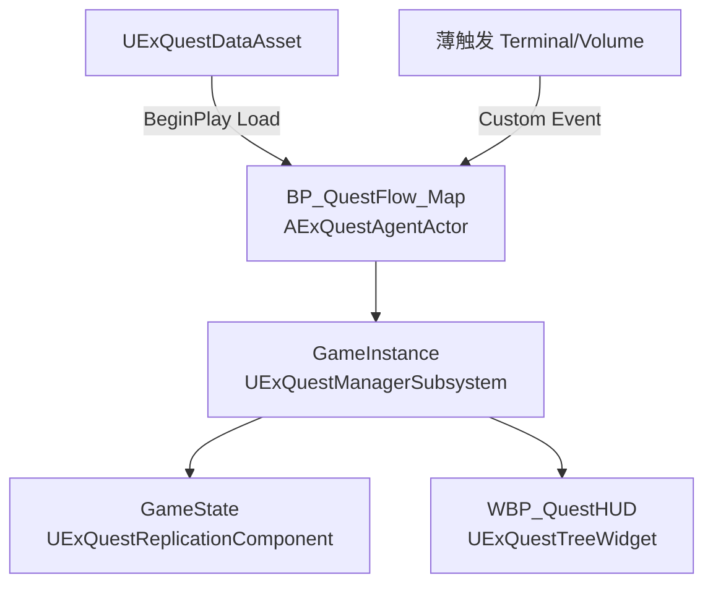

# 单地图任务链示例（Agent = Quest Flow）

> UTF-8。`AExQuestAgentActor` **不**挂 `QuestFlowClass`；在 **Agent 蓝图子类** Event Graph 里拉 Quest Task 完成本图链路与战斗编排。API/术语见 [QuestSystemGuide.md](./QuestSystemGuide.md)。

---

## 架构



| 组件 | 职责 |
|------|------|
| **DA** | Task/Objective 定义、父子树、汇总；**不**写本图逐步顺序 |
| **Agent** | 本图唯一任务链：Load、Activate、Quest Task 串行、战斗 |
| **薄触发** | 只调 Agent Custom Event |
| **HUD** | 读 Manager 全任务状态（不直接绑 DA） |
| **Rep** | 联机进度复制 |

**数据流：** `DA → Agent Load → Manager → OnQuestDataLoaded → TreeWidget Refresh`

---

## 搭建步骤

### 1. DA（可由 DataTable 自动生成）

1. 建表 **`DT_Quest_TestMap`**，Row Type = **`FExQuestTaskTableRow`**，填任务行。
2. 内容浏览器右键表 → **Import To Paired Quest Data Asset** → 生成/更新同目录 **`DA_Quest_TestMap`**（`DT_` → `DA_` 命名规则）。
3. 打开 DA，**Source Task Table** 会指向源表；改表后可再点 **Import From Source Task Table** 或右键表重新导入。
4. `QuestSetId` 默认与 DA 资产名一致；Tag 在 `DefaultGameplayTags.ini` 注册。

### 2. Agent 蓝图

- 父类 **`AExQuestAgentActor`**（如 `BP_QuestFlow_Map_Factory`）
- `Quest Data Asset` = 上一步 DA，`Auto Load On Begin Play` = true
- 关卡放 **一个** 实例；任务链全画在此蓝图，**勿**再建 QuestFlow 类
- C++ 默认：`bReplicates`、`bAlwaysRelevant`、`DORM_Never`（避免距离/网络相关性导致 BeginPlay 链不跑）

### 3. 薄触发

- `BP_Terminal_A` → `OnTerminalAUsed`
- `BP_POI_Outpost_Volume` → `OnPOIOutpostEntered`
- **禁止**在 Terminal/Volume 里挂 Quest Task 链

### 4. HUD

- Widget 父类 **`UExQuestTreeWidget`**（可参考 `Content/Quest/WBP_QuestTree`）
- Bind Widget：`RootQuestContainer`、`QuestScrollBox`、`TitleText`
- **`bAutoSyncFromManager`** = true → 无需在 Widget 指定 DA
- `Create Widget` → `Add to Viewport`（PlayerController/HUD BeginPlay）
- 正式流程：**仅 Agent Load DA**；勿用 `SetQuestData`（会写回 Manager，仅调试用）
- 联机：Client 只读 Manager（Rep 对齐），勿再 Load DA

### 5. 联机

- GameState 带 `UExQuestReplicationComponent`（或 `AExQuestGameStateBase`）
- Agent Load/跑链仅在 **Server / Standalone**（基类 `HasAuthority()`）

---

## 示例 DA（Map_Factory）

**本图步骤顺序由 Agent Quest Task 链控制，不用 `PreTaskIds`（仅跨图硬门槛时用）。**

| TaskId | ParentTaskId | SubTaskIds | InitialState |
|--------|--------------|------------|--------------|
| `Quest.Op.Global` | — | `Quest.POI.Factory`, `Quest.POI.Outpost` | Locked |
| `Quest.POI.Factory` | `Quest.Op.Global` | — | Locked |
| `Quest.POI.Outpost` | `Quest.Op.Global` | — | Locked |

| TaskId | ObjectiveTag | TargetProgress |
|--------|--------------|----------------|
| `Quest.POI.Factory` | `Quest.POI.Factory.Defend` | 1 |
| `Quest.POI.Outpost` | `Quest.POI.Outpost.Hold60` | 1 |

---

## Agent 蓝图链（示意）

### 开局

```
BeginPlay → Unlock/Activate Quest.Op.Global
         → Unlock Quest.POI.Factory / Quest.POI.Outpost
```

### Terminal → 清场

```
BP_Terminal_A → OnTerminalAUsed
  → Activate Quest.POI.Factory
  → Quest Task（Class=`BP_Quest_DefendFactory`；节点上可改 QuestTag/ObjectiveTag，默认来自该 BP Class Defaults）
      Latent: 刷怪 → 全灭 → Completed
      Completed → 音效/UI（可选）
```

### POI 存活 60s

```
Volume → OnPOIOutpostEntered
  → Activate Quest.POI.Outpost
  → Quest Task (...Hold60, Delay 60s，离开可 Cancel→Failed)
```

- **并行**：两 POI 各自 Custom Event 启动即可
- **先后**：Quest Task `Completed →` 下一 Task / Activate，**勿**在 DA 写同图 `PreTaskIds`
- **战斗**：刷怪/波次接在 Quest Task `Completed` 后，与任务同 Actor

---

## 分工与权威

| 内容 | 位置 |
|------|------|
| 本图先后顺序 | **Agent Quest Task 链** |
| 任务树、Objective、父子汇总 | **DA** |
| 跨图硬解锁 | **DA `PreTaskIds`** |
| 单步反馈（音效等） | Quest Task `Completed` 后 |
| 任务列表 UI | **WBP_QuestHUD**（Manager 委托） |
| 战役完成庆祝 | Agent 链尾或 HUD 判 `Quest.Op.Global` Completed（勿只绑某一子 Task） |

改顺序 → 只改 Agent；改树/汇总 → 改 DA 且 Flow 须 Complete 各 SubTask。`QuestTag` / `ObjectiveTag` 须在 DA 中存在；可在任务 BP Class Defaults 预设，图上 Quest Task 选 Class 后会带出引脚并可覆盖。

---

## 进测前检查

- [ ] 关卡一个 `BP_QuestFlow_*`，已指定 DA
- [ ] 联机：GameState 有 Quest Replication
- [ ] Flow 用到的 Tag 已注册且有 Objective
- [ ] Terminal/POI 只调 Agent 事件
- [ ] HUD 显示 Global + 子 POI
- [ ] Client 不本地改进度

---

## DataTable → DA 速查

| 问题 | 答案 |
|------|------|
| 只保存 DT 会更新 DA 吗？ | **不会**，须右键 **Import To Paired Quest Data Asset** |
| 命名 | `DT_Quest_Test` → `DA_Quest_Test`（`DT_` 换 `DA_`） |
| DA 与 DT 运行时关系 | 仅 **拷贝**；游戏只 Load **DA** |
| 成功提示 | 右下角绿色通知（非错误） |

---

## 相关文档

- [QuestSystemGuide.md](./QuestSystemGuide.md) — API、术语、联机、DataTable 小节
- [Usage.md](./Usage.md) — 节点速查 + **DT→DA 步骤**
- [QuestDevPlan.md](./QuestDevPlan.md) — 阶段与待办
- [Architecture.md](./Architecture.md) — Latent / Quest 类关系
