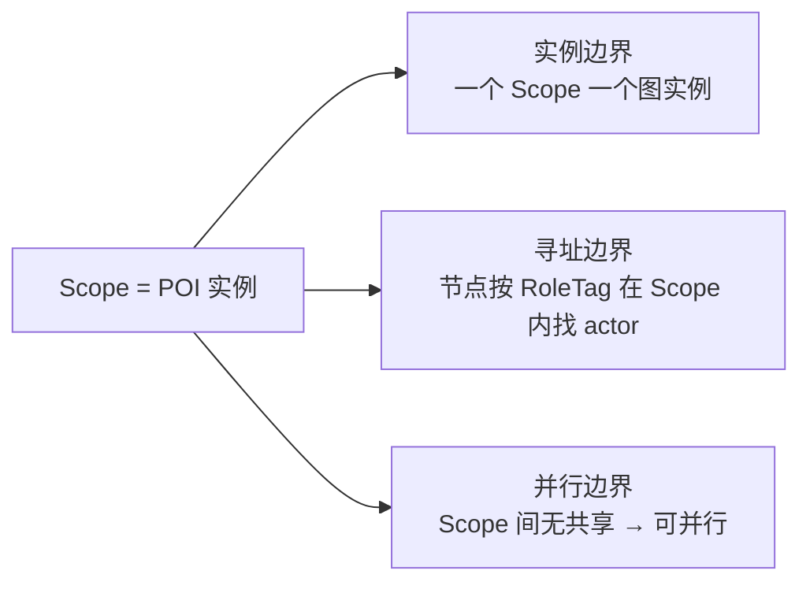
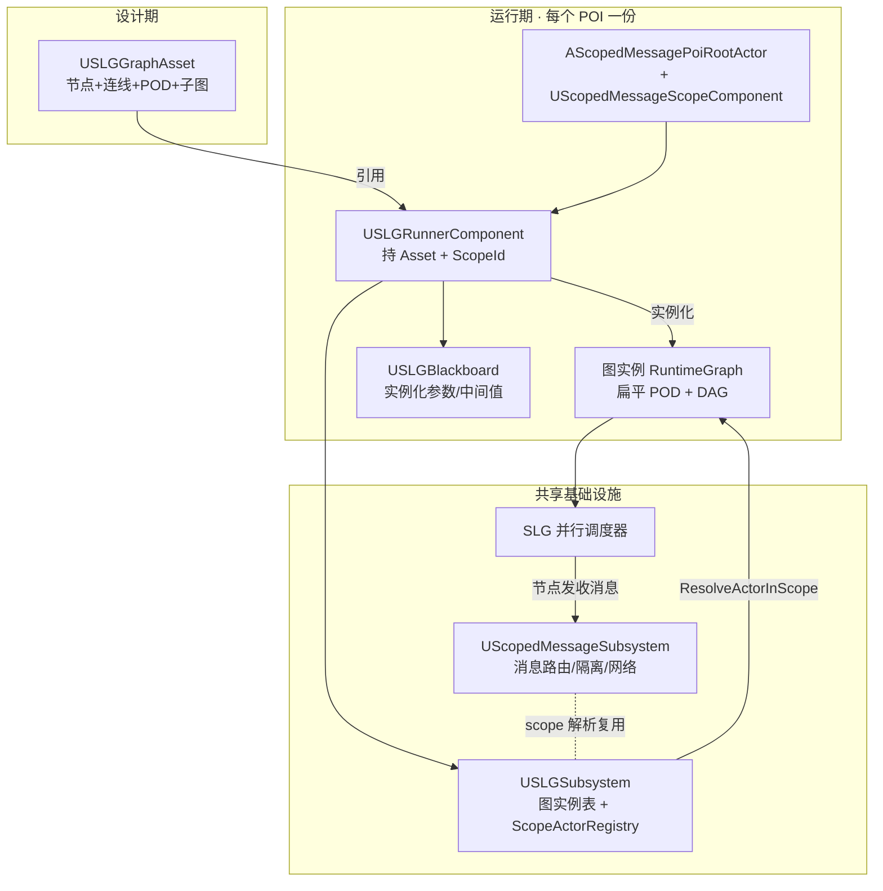
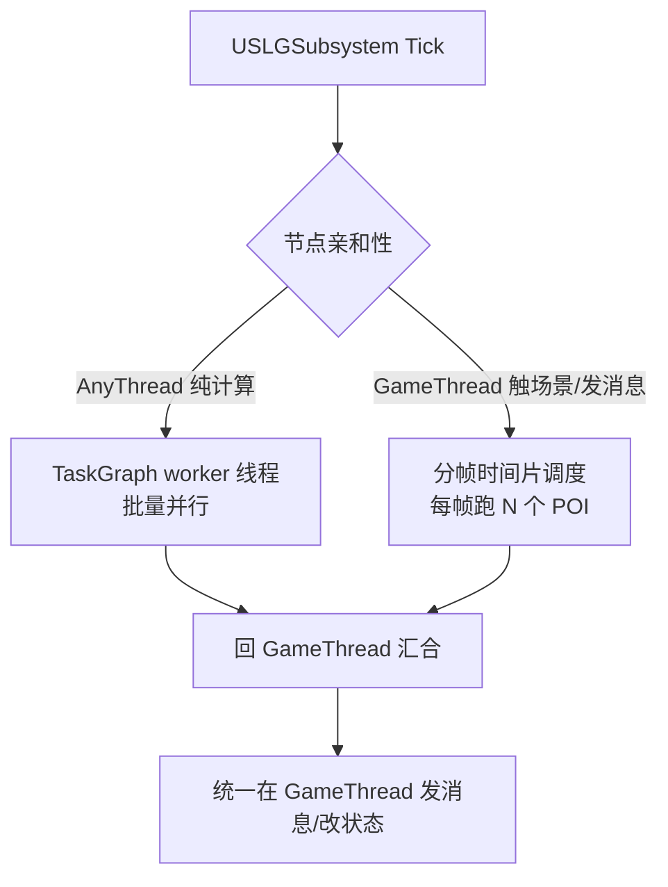

# ScopedLogicGraph 作用域并行逻辑图 · 设计文档

> 版本：Draft v0.1　·　目标引擎：UE 5.7　·　简称：SLG
>
> 本文取代旧的《UE5多节点并行计算图与编辑器方案》（Web 方案已弃用）。

---

## 1. 一句话定位

**ScopedLogicGraph 是一套数据驱动、按作用域实例化、可并行执行的游戏逻辑图框架**，用同一套底层支撑 **任务 / 战斗 / AI 行为** 三类玩法逻辑，专为 *百人规模、场景含上百 POI* 的项目设计。

它不发明新东西，而是把项目里已有的三块能力拼成一套闭环：

| 层 | 承载物 | 职责 |
|---|---|---|
| 作用域地基 | `ScopedMessageSystem`（已存在） | POI 实例身份、局部寻址、消息隔离、网络分区 |
| **逻辑图执行（本框架）** | `ScopedLogicGraph`（新建） | 在作用域上跑的并行数据图 |
| 编辑与就地逻辑 | `BlueprintNodeGraph` 经验 | 图编辑器、蓝图节点 |

> 三者未来可整合为一个大插件（暂定名 `HierarchicalLevelLogic`），但**本期不动插件结构**，只新建 SLG 这一层。

---

## 2. 设计目标与非目标

| | 内容 |
|---|---|
| ✅ 目标 | 图是**独立数据资产**（可序列化、可导出、可子图、服务器可加载） |
| ✅ 目标 | **局部寻址**：节点引用 POI 内对象不依赖全局唯一 ID |
| ✅ 目标 | **两级并行**：POI 级分帧调度 + 图内纯计算节点上 worker 线程 |
| ✅ 目标 | 通用：任务 / 战斗 / AI 共用同一图内核，按域派生节点 |
| ✅ 目标 | 保留"策划在蓝图里就地写节点逻辑"的便利 |
| ✅ 目标 | 复用 `ScopedMessageSystem` 的 scope / 网络 / 隔离，不重造 |
| ❌ 非目标 | Web / 外部编辑器（本期排除，数据格式留出未来扩展口） |
| ❌ 非目标 | GPU / 数值计算（名字特意避开 "Compute"） |
| ❌ 非目标 | 取代蓝图 VM；强场景耦合的一次性逻辑仍可走原 K2Node 蓝图 |

---

## 3. 核心设计哲学

### 3.1 三位一体的 Scope

整套方案的支点只有一句话：

> **Scope（= 一个 POI 实例 = 一个 LevelInstance 实例）同时是 _实例边界_、_寻址边界_、_并行边界_。**



这把前几轮纠结的三件事一次性解开：图能数据化、寻址不需全局 ID、并行有天然边界。

### 3.2 图 = 模板 + 实例化（与 LevelInstance 同构）

| LevelInstance | ScopedLogicGraph |
|---|---|
| 关卡模板 | `USLGGraphAsset`（纯数据模板） |
| 实例化 N 份 | 每份绑一个 `FScopedMessageScopeId` = 一个图实例 |
| 实例内 actor 布局 | 节点用 `RoleTag`（模板内唯一即可） |
| 实例运行时身份 | 复用 ScopeComponent 自动生成的 ScopeId |

一份 Asset 跑在 100 个 POI 上 = 100 个图实例，各自绑各自 ScopeId，互不串扰。

### 3.3 局部寻址：杀死"全局唯一 ID"

```
全局寻址(FlowGraph)：Asset ──直接引用──▶ 全局唯一 actor   → O(全场 actor)，复杂度爆炸
作用域寻址(SLG)：   (ScopeId 自动) × (RoleTag 模板内手填) → O(单 POI 内 actor)，可控
```

标识符**只需在 LevelInstance 模板内唯一**（一个 `FGameplayTag` 角色标签即可），运行时由 ScopeId 自动区分实例。

---

## 4. 架构总览



---

## 5. 数据模型（设计期）

### 5.1 图资产 `USLGGraphAsset`

纯数据模板，**不含坐标/样式以外的运行期状态**（编辑器布局可单独存或自动排版）。

```cpp
// Pure data template. One asset can be instanced under many POI scopes.
UCLASS(BlueprintType)
class USLGGraphAsset : public UDataAsset
{
    GENERATED_BODY()
public:
    // Graph domain hint: Task / Combat / AI. Drives editor filtering and defaults.
    UPROPERTY(EditAnywhere) FGameplayTag Domain;

    // All nodes owned by this graph (UObject instances, not K2 functions).
    UPROPERTY(EditAnywhere, Instanced) TArray<TObjectPtr<USLGNode>> Nodes;

    // Edges as index pairs; runtime bakes these into a flat DAG.
    UPROPERTY(EditAnywhere) TArray<FSLGEdge> Edges;

    // Optional sub-graph references. Nesting mirrors LevelInstance nesting.
    UPROPERTY(EditAnywhere) TArray<TObjectPtr<USLGGraphAsset>> SubGraphs;
};
```

### 5.2 节点 `USLGNode`

```cpp
// Base node. Logic lives in Execute; data lives in reflected POD properties.
UCLASS(Abstract, BlueprintType, Blueprintable, EditInlineNew)
class USLGNode : public UObject
{
    GENERATED_BODY()
public:
    // Thread affinity decides whether the scheduler may run this off GameThread.
    virtual ESLGThreadAffinity GetThreadAffinity() const { return ESLGThreadAffinity::GameThread; }

    // Native execution entry. Context carries scope, blackboard, registry.
    virtual ESLGNodeStatus Execute(FSLGExecContext& Ctx) { return ESLGNodeStatus::Succeeded; }

    // Blueprint hook for designer-authored, scene-coupled logic (kept on GameThread).
    UFUNCTION(BlueprintImplementableEvent, DisplayName="Execute")
    void BP_Execute(const FSLGExecContext& Ctx);

    // Local addressing: which actor role(s) inside the scope this node needs.
    UPROPERTY(EditAnywhere, Category="Addressing") FGameplayTag TargetRole;
};
```

### 5.3 线程亲和性与状态

```cpp
// AnyThread nodes must be side-effect free (no UObject create/destroy, no messaging).
UENUM() enum class ESLGThreadAffinity : uint8 { GameThread, AnyThread };

UENUM() enum class ESLGNodeStatus : uint8 { Running, Succeeded, Failed, Aborted };
```

---

## 6. 运行时

### 6.1 运行器组件 `USLGRunnerComponent`

挂在 `AScopedMessagePoiRootActor`（或任何带 `UScopedMessageScopeComponent` 的 actor）上。

| 职责 | 说明 |
|---|---|
| 取 ScopeId | 从同 actor 的 `ScopeComponent->GetScopeId()` |
| 实例化图 | Asset → `RuntimeGraph`（扁平 POD + 拓扑分层 DAG） |
| 注册 | 向 `USLGSubsystem` 登记本图实例，参与全局调度 |
| 持有黑板 | `USLGBlackboard`，承接本实例的场景引用与中间值 |

### 6.2 局部寻址：`ScopeActorRegistry`（唯一要新建的基础设施）

现有 `ScopedMessageSubsystem` 已有 `ResolveScopeId(object → scopeId)`；SLG 只需补**反向**查询。

```cpp
// (ScopeId, RoleTag) -> actor inside that scope. Fills the gap left by the
// message subsystem, reusing its actor spawn/endplay hooks for maintenance.
UCLASS()
class USLGSubsystem : public UGameInstanceSubsystem
{
    GENERATED_BODY()
public:
    AActor* ResolveActorInScope(FScopedMessageScopeId Scope, FGameplayTag RoleTag) const;
    void RegisterActorRole(AActor* Actor, FGameplayTag RoleTag); // resolves scope internally

private:
    // Scope -> Role -> Actor. Weak pointers; swept on EndPlay like the routing table.
    TMap<FScopedMessageScopeId, TMap<FGameplayTag, TWeakObjectPtr<AActor>>> ScopeActorRegistry;
};
```

POI 内的 actor 在 BeginPlay 时 `RegisterActorRole(this, MyRole)`，scope 由现有 resolver 链自动解析——**不需要任何全局 ID**。

### 6.3 与 ScopedMessageSystem 的对接

| SLG 需求 | 复用现有 |
|---|---|
| POI 实例身份 | `FScopedMessageScopeId` / `UScopedMessageScopeComponent` |
| 节点间 / POI 内事件 | `BroadcastMessage` / `Subscribe`（隔离免费） |
| 服务器→特定 POI 玩家 | `ServerToScopedClients` + 玩家兴趣表 |
| 对象→所属 POI | `ResolveScopeId` |

---

## 7. 并行执行模型（务实版）

> ⚠️ 关键约定：`ScopedMessageSubsystem` 的路由表与所有 UObject/Actor 访问**只能在 GameThread**。因此并行不是"所有节点满天飞"，而是**分两种**：



| 并行类型 | 适用节点 | 机制 | 收益来源 |
|---|---|---|---|
| **Worker 并行** | 纯计算（感知评分、伤害结算、寻路预算等，无副作用、POD 数据） | TaskGraph 批量派发 | 多核，重计算密集时收益大 |
| **分帧调度** | 触及 actor/发消息的节点 | 每帧按预算跑一批 POI，其余顺延 | 摊平百 POI 的 GameThread 峰值 |

**诚实结论**：纯"上百 POI 全核并行"只在纯计算节点占比高时成立；触场景节点仍受 GameThread 串行约束，靠分帧把峰值摊平。设计上鼓励把重计算拆成 `AnyThread` 节点，把场景写操作收敛到少数 `GameThread` 节点。

> Scope 间无共享状态（由 `ScopedMessageSystem` 的隔离保证）是这套并行成立的前提——这正是它相对 FlowGraph 全局模型不可替代的价值。

---

## 8. 蓝图与就地逻辑

- 90% 逻辑是可复用积木 → C++ 数据节点（`USLGNode` 派生）。
- 强场景耦合的一次性逻辑 → 节点 BP 子类里 override `BP_Execute`（强制 GameThread）。沿用你 `AScopedMessagePoiActor::BP_OnPoiScopeReady` 已在用的同款模式。
- 真·特例 → 仍可走原 `BlueprintNodeGraph` K2Node，双轨并存。

---

## 9. 网络与服务器

- 图是数据 → **dedicated server 直接加载执行**（百人权威逻辑跑服务端）。
- 状态权威：耐久状态走正常 gameplay 组件复制；SLG 节点只发"触发/通知"型 scoped message（与现有文档约定一致："Messages are not the source of truth"）。
- POI 级网络分区直接用 `ServerToScopedClients`，避免全局 multicast。

---

## 10. 编辑器（后置）

- 第一阶段**不做可视化编辑器**：图用 `UDataAsset` + Details 面板 / 简单导入手搓，先把运行时跑通。
- 第二阶段再上 Slate 图编辑器，骨架借鉴 [FlowGraph](https://github.com/MothCocoon/FlowGraph)（自定义 `UEdGraph` + UObject 节点 + 子图 + PIE 调试），复用 `BlueprintNodeGraph` 的 Slate/调试经验。
- 自动排版（dagre 式）+ 基于反射自动生成属性表单，这两个降复杂度的点保留。

---

## 11. 关键类型清单

| 类型 | 种类 | 职责 |
|---|---|---|
| `USLGGraphAsset` | UDataAsset | 图模板（节点/连线/子图/POD） |
| `USLGNode` | UObject | 节点基类（Execute + 亲和性 + RoleTag） |
| `USLGRunnerComponent` | ActorComponent | 绑 ScopeId、实例化图、持黑板 |
| `USLGBlackboard` | UObject | 实例化参数 / 节点间数据 |
| `USLGSubsystem` | GameInstanceSubsystem | 图实例表 + `ScopeActorRegistry` + 调度入口 |
| `FSLGExecContext` | struct | 传给节点：ScopeId/黑板/registry/世界 |
| `FSLGEdge` / `FSLGRuntimeGraph` | struct | 连线 / 烘焙后的扁平 DAG |
| `ESLGThreadAffinity` / `ESLGNodeStatus` | enum | 线程亲和性 / 执行状态 |

---

## 12. 开发里程碑

| 阶段 | 内容 | 产出 |
|---|---|---|
| **M0 内核串行** | 数据模型 + RuntimeGraph + 全 GameThread 顺序执行，接 ScopeId/ScopedMessage | 单 POI 任务图跑通 |
| **M1 寻址+黑板** | `ScopeActorRegistry` 局部寻址 + `USLGBlackboard` | 节点按 RoleTag 取本 POI actor |
| **M2 并行** | 亲和性标记 + worker 纯计算并行 + 分帧调度 | 上百 POI 压测达标 |
| **M3 蓝图节点** | `BP_Execute` 支持 + 节点蓝图基类 | 策划可就地写节点 |
| **M4 编辑器** | Slate 图编辑器（借 FlowGraph） | 可视化编辑 + PIE 调试 |
| **M5 网络/导出** | dedicated server 验证 + 数据导出（为未来 Web/工具留口） | 服务器权威跑图 |

---

## 13. 风险与取舍

| 风险 | 应对 |
|---|---|
| 并行收益依赖纯计算节点比例 | 设计上引导"重计算拆 AnyThread、场景写收敛 GameThread"；M0 先全串行保证正确性 |
| worker 线程禁止 UObject 创建/销毁、禁止发消息 | `AnyThread` 节点强约束为 POD 无副作用；汇合后统一在 GameThread 落地副作用 |
| 编辑器工作量大 | 后置到 M4；M0–M3 用 DataAsset 手搓不阻塞内核 |
| 与 `BlueprintNodeGraph` 双轨期迁移成本 | 双轨并存，不强制迁移；新逻辑优先走 SLG |
| 插件未来整合改名 | 先独立成 `ScopedLogicGraph`；`HierarchicalLevelLogic` 合并以后再说 |

---

## 14. 待定问题（开发前需拍板）

1. **黑板形态**：强类型 `FInstancedStruct` 键值，还是仿行为树的 Key/Type 表？（建议 `FInstancedStruct`，与 ScopedMessage 载荷一致）
2. **图实例生命周期**：随 POI actor BeginPlay/EndPlay，还是随玩家进入/离开 POI 流式启停？
3. **子图执行语义**：子图是同步内联展开，还是作为独立可并行的子作用域？
4. **RuntimeGraph 序列化**：M0 直接用 UObject 序列化即可；是否在 M5 引入 FlatBuffers/紧凑格式（旧方案的零拷贝诉求）由导出需求决定。
5. **插件落点**：文档暂存于 `Plugins/ComputeGraph/Doc/`；是否本期就把目录物理改名为 `Plugins/ScopedLogicGraph/`？

---

> 文档定稿后即可从 **M0** 切入。建议第一步：建 `ScopedLogicGraph` 模块骨架 + `USLGGraphAsset`/`USLGNode`/`USLGRunnerComponent` 三个核心类，串行跑通一个最小任务图并接上 `ScopedMessageSubsystem`。
