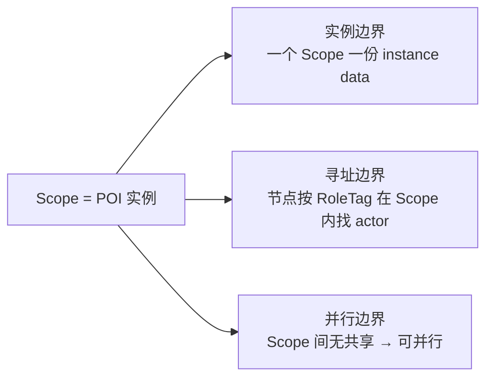
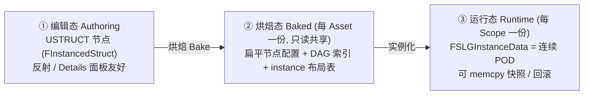
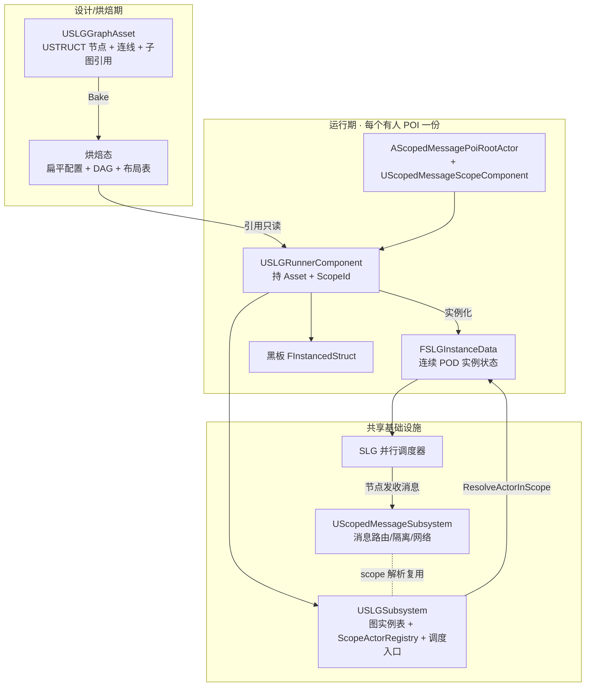
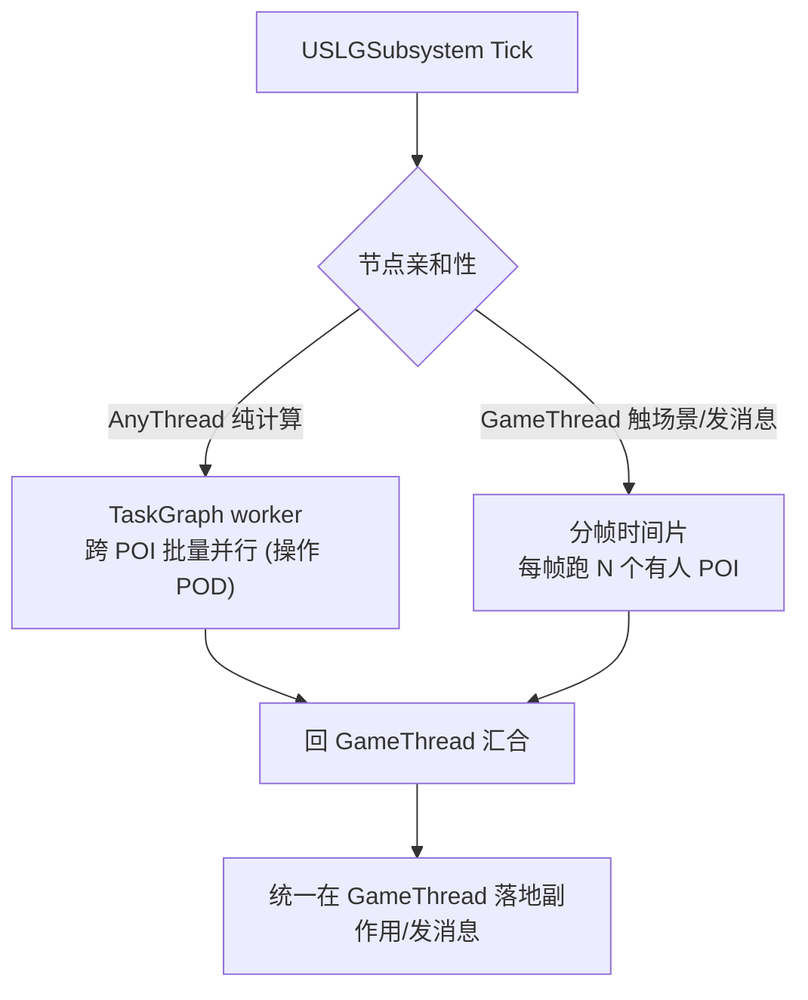

# ScopedLogicGraph 作用域并行逻辑图 · 设计文档

> 版本：Draft v0.2　·　目标引擎：UE 5.7　·　简称：SLG
>
> 本文取代旧的《UE5多节点并行计算图与编辑器方案》（Web 方案已弃用）。
> v0.2 变更：节点模型从 UObject 改为**数据导向**（StateTree/Mass 范式），并锁定 5 项关键决策。

---

## 1. 一句话定位

**ScopedLogicGraph 是一套数据导向、按作用域实例化、可并行执行的游戏逻辑图框架**，用同一套底层支撑 **任务 / 战斗 / AI 行为** 三类玩法逻辑，专为 *百人规模、场景含上百 POI* 的项目设计。

它把项目里已有的三块能力拼成闭环：

| 层 | 承载物 | 职责 |
|---|---|---|
| 作用域地基 | `ScopedMessageSystem`（已存在） | POI 实例身份、局部寻址、消息隔离、网络分区 |
| **逻辑图执行（本框架）** | `ScopedLogicGraph`（已建模块骨架） | 在作用域上跑的并行数据图 |
| 编辑与就地逻辑 | `BlueprintNodeGraph` 经验 | 图编辑器、蓝图节点 |

> 三者未来可整合为大插件 `HierarchicalLevelLogic`，但**本期不动结构**，只建 SLG 这一层。

---

## 2. 已锁定的关键决策

| # | 议题 | 决策 |
|---|---|---|
| 1 | 黑板形态 | **`FInstancedStruct`** 键值，与 ScopedMessage 载荷同源 |
| 2 | 图实例生命周期 | **随玩家进入/离开 POI**；只要 POI 内有人即开启，无人则休眠/释放 |
| 3 | 子图 | **数据上独立**（各自 Asset + 各自 instance data 块）；**编辑器提供统一入口**（drill-in 进入子图） |
| 4 | 节点存储 | **数据导向**：节点为 `USTRUCT`（`FInstancedStruct` 存储），行为无状态共享，实例状态为连续 POD —— 非 UObject-per-node |
| 5 | 插件命名 | 已从 `ComputeGraph` 改名为 **`ScopedLogicGraph`** |

---

## 3. 设计目标与非目标

| | 内容 |
|---|---|
| ✅ | 图是**独立数据资产**（可序列化、可导出、可子图、服务器可加载） |
| ✅ | **局部寻址**：节点引用 POI 内对象不依赖全局唯一 ID |
| ✅ | **数据导向**：运行期无 per-node UObject，连续 POD，**可 memcpy 快照/回滚** |
| ✅ | **两级并行**：POI 级分帧调度 + 图内纯计算节点上 worker 线程 |
| ✅ | 通用：任务 / 战斗 / AI 共用图内核，按域派生节点 |
| ✅ | 保留"策划在蓝图里就地写节点逻辑"（慢路径） |
| ✅ | 复用 `ScopedMessageSystem`，不重造 scope/网络/隔离 |
| ❌ | Web / 外部编辑器（本期排除，数据格式留扩展口） |
| ❌ | GPU / 数值计算（特意避开 "Compute" 命名） |
| ❌ | 取代蓝图 VM；强场景耦合的一次性逻辑仍可走原 K2Node 蓝图 |

---

## 4. 核心设计哲学

### 4.1 三位一体的 Scope

> **Scope（= 一个 POI 实例 = 一个 LevelInstance 实例）同时是 _实例边界_、_寻址边界_、_并行边界_。**



### 4.2 三态分离（数据导向的关键）

UObject-per-node 在百 POI 规模会触发 GC 风暴与缓存劣化。SLG 采用 StateTree/Mass 同款三态：



| 态 | 存什么 | 谁拥有 | 特性 |
|---|---|---|---|
| 编辑态 | USTRUCT 节点 + 连线 + 默认值 | `USLGGraphAsset` | 反射、可视化、可改 |
| 烘焙态 | 扁平配置数组 + DAG + 行为绑定 + 布局表 | `USLGGraphAsset`（编译产物，只读共享） | 缓存友好、零分配 |
| 运行态 | 每节点的实例状态（POD） | 每个 Scope 一份 `FSLGInstanceData` | 连续内存、可 memcpy |

> 行为（logic）无状态、按节点类型共享（flyweight）；实例状态（per scope）才是每实例一份的 POD。这与项目 `CLTypes` 里"POD 扁平支持 Memcpy 回滚"的规则同源，并为将来帧同步/回滚预留通路。

### 4.3 图 = 模板 + 实例化（与 LevelInstance 同构）

| LevelInstance | ScopedLogicGraph |
|---|---|
| 关卡模板 | `USLGGraphAsset`（数据模板，编译出烘焙态） |
| 实例化 N 份 | 每份绑一个 `FScopedMessageScopeId` → 一份 `FSLGInstanceData` |
| 实例内 actor 布局 | 节点用 `RoleTag`（模板内唯一即可） |
| 实例运行时身份 | 复用 ScopeComponent 自动生成的 ScopeId |

### 4.4 局部寻址：杀死"全局唯一 ID"

```
全局寻址(FlowGraph)：Asset ──直接引用──▶ 全局唯一 actor   → O(全场 actor)，复杂度爆炸
作用域寻址(SLG)：   (ScopeId 自动) × (RoleTag 模板内手填) → O(单 POI 内 actor)，可控
```

---

## 5. 架构总览



---

## 6. 数据模型

### 6.1 图资产 `USLGGraphAsset`（编辑态）

```cpp
// Authoring asset. Nodes are USTRUCTs stored as FInstancedStruct, not UObjects.
// Bake() compiles this into a flat, cache-friendly baked form.
UCLASS(BlueprintType)
class USLGGraphAsset : public UDataAsset
{
    GENERATED_BODY()
public:
    // Task / Combat / AI. Drives editor filtering and defaults.
    UPROPERTY(EditAnywhere) FGameplayTag Domain;

    // Authoring nodes. Each element wraps an FSLGNodeBase-derived struct.
    UPROPERTY(EditAnywhere, meta=(BaseStruct="/Script/ScopedLogicGraph.SLGNodeBase"))
    TArray<FInstancedStruct> Nodes;

    // Edges as index pairs; Bake() flattens them into a topological DAG.
    UPROPERTY(EditAnywhere) TArray<FSLGEdge> Edges;

    // Sub-graphs are data-independent assets; editor offers drill-in navigation.
    UPROPERTY(EditAnywhere) TArray<TObjectPtr<USLGGraphAsset>> SubGraphs;

    // Compiled, read-only, shared across all scope instances.
    UPROPERTY(Transient) FSLGBakedGraph Baked;

    void Bake(); // authoring -> baked
};
```

### 6.2 节点 `FSLGNodeBase`（USTRUCT，无状态行为）

```cpp
// Stateless behavior. Static config lives in derived struct fields (shared).
// Per-instance mutable state lives in FSLGInstanceData, addressed by offset.
USTRUCT()
struct FSLGNodeBase
{
    GENERATED_BODY()
    virtual ~FSLGNodeBase() = default;

    // Off-GameThread only allowed for side-effect-free pure compute.
    virtual ESLGThreadAffinity GetThreadAffinity() const { return ESLGThreadAffinity::GameThread; }

    // Note: const -> behavior is stateless; mutate instance state via Ctx.
    virtual ESLGNodeStatus Execute(FSLGExecContext& Ctx) const { return ESLGNodeStatus::Succeeded; }

    // Local addressing: which actor role inside the scope this node needs.
    UPROPERTY(EditAnywhere, Category="Addressing") FGameplayTag TargetRole;
};

// Example concrete node: static config (Duration) shared; remaining time per-instance.
USTRUCT()
struct FSLGNode_Wait : public FSLGNodeBase
{
    GENERATED_BODY()
    UPROPERTY(EditAnywhere) float Duration = 1.f; // shared config
    // instance state (e.g. Elapsed) is declared via the node's instance-data struct
};
```

### 6.3 蓝图就地逻辑：慢路径节点

```cpp
// Designer escape hatch. Holds a lightweight UObject to run BP_Execute.
// Forced to GameThread; kept off the hot POD path. Use sparingly.
USTRUCT()
struct FSLGNode_BlueprintProxy : public FSLGNodeBase
{
    GENERATED_BODY()
    UPROPERTY(EditAnywhere) TSubclassOf<USLGBlueprintNodeObject> NodeClass;
    virtual ESLGThreadAffinity GetThreadAffinity() const override { return ESLGThreadAffinity::GameThread; }
};
```

### 6.4 实例状态与黑板（运行态）

```cpp
// Per-scope contiguous POD blob. memcpy-able for snapshot/rollback.
USTRUCT()
struct FSLGInstanceData
{
    GENERATED_BODY()
    TArray<uint8> NodeStateBlob;          // node instance states by baked offset
    TArray<FInstancedStruct> Blackboard;  // decision #1: FInstancedStruct keys
};
```

### 6.5 枚举

```cpp
// AnyThread nodes must be side-effect free (no UObject create/destroy, no messaging).
UENUM() enum class ESLGThreadAffinity : uint8 { GameThread, AnyThread };
UENUM() enum class ESLGNodeStatus    : uint8 { Running, Succeeded, Failed, Aborted };
```

---

## 7. 运行时

### 7.1 运行器组件 `USLGRunnerComponent`

挂在 `AScopedMessagePoiRootActor`（或任何带 `UScopedMessageScopeComponent` 的 actor）上。

| 职责 | 说明 |
|---|---|
| 取 ScopeId | 从同 actor 的 `ScopeComponent->GetScopeId()` |
| 实例化 | 按烘焙态布局分配 `FSLGInstanceData`（连续 POD） |
| 生命周期 | **玩家进入 POI → 激活；POI 无人 → 休眠/释放**（决策 #2） |
| 注册 | 向 `USLGSubsystem` 登记，参与全局调度 |
| 黑板 | 持本实例 `FInstancedStruct` 黑板 |

> 生命周期直接复用 `ScopedMessageSystem` 的玩家兴趣机制：`RegisterPlayerForScope` / `UnregisterPlayerForScope` 已经在跟踪"谁对哪个 POI 感兴趣"，SLG 据此判定 POI 是否有人。

### 7.2 局部寻址：`ScopeActorRegistry`（唯一新建基础设施）

现有 `ScopedMessageSubsystem` 已有 `ResolveScopeId(object → scopeId)`；SLG 只补**反向**查询。

```cpp
// (ScopeId, RoleTag) -> actor inside that scope. Reuses the message subsystem's
// actor spawn/endplay hooks for maintenance. No global unique IDs needed.
UCLASS()
class USLGSubsystem : public UGameInstanceSubsystem
{
    GENERATED_BODY()
public:
    AActor* ResolveActorInScope(FScopedMessageScopeId Scope, FGameplayTag RoleTag) const;
    void RegisterActorRole(AActor* Actor, FGameplayTag RoleTag); // scope resolved internally

private:
    TMap<FScopedMessageScopeId, TMap<FGameplayTag, TWeakObjectPtr<AActor>>> ScopeActorRegistry;
};
```

### 7.3 与 ScopedMessageSystem 的对接

| SLG 需求 | 复用现有 |
|---|---|
| POI 实例身份 | `FScopedMessageScopeId` / `UScopedMessageScopeComponent` |
| 节点间 / POI 内事件 | `BroadcastMessage` / `Subscribe`（隔离免费） |
| POI 是否有人（生命周期） | 玩家兴趣表 `RegisterPlayerForScope` |
| 服务器→特定 POI 玩家 | `ServerToScopedClients` |
| 对象→所属 POI | `ResolveScopeId` |

---

## 8. 并行执行模型（务实版）

> ⚠️ 约定：`ScopedMessageSubsystem` 路由表与所有 UObject/Actor 访问**只能在 GameThread**。数据导向让纯计算节点彻底脱离 UObject，正好喂给 worker 线程。



| 并行类型 | 适用节点 | 机制 | 收益 |
|---|---|---|---|
| **Worker 并行** | 纯计算（感知评分、伤害结算、寻路预算，无副作用、纯 POD） | TaskGraph 批量 | 多核；数据导向后 POD 可安全跨线程 |
| **分帧调度** | 触 actor/发消息节点 | 每帧按预算跑一批有人 POI | 摊平百 POI 的 GameThread 峰值 |

**诚实结论**：纯计算节点占比越高，worker 并行收益越大；触场景节点仍受 GameThread 约束，靠分帧摊峰值。设计上引导"重计算拆 `AnyThread` POD 节点、场景写收敛到少数 `GameThread` 节点"。Scope 间无共享（由 `ScopedMessageSystem` 隔离保证）是并行成立前提。

---

## 9. 网络与服务器

- 烘焙态是数据 → **dedicated server 直接加载执行**（百人权威逻辑跑服务端）。
- 权威状态走正常 gameplay 组件复制；SLG 节点只发"触发/通知"型 scoped message（遵循现有约定 "Messages are not the source of truth"）。
- POI 级网络分区用 `ServerToScopedClients`，避免全局 multicast。

---

## 10. 编辑器（后置）

- **第一阶段不做可视化编辑器**：用 `USLGGraphAsset` + Details 面板（`FInstancedStruct` 自带反射 UI）手搓，先把运行时跑通。
- 第二阶段上 Slate 图编辑器，骨架借鉴 [FlowGraph](https://github.com/MothCocoon/FlowGraph)（自定义 `UEdGraph`），复用 `BlueprintNodeGraph` 的 Slate/调试经验。
- 子图（决策 #3）：数据上独立 Asset，编辑器提供 **drill-in 统一入口**（双击子图节点进入，面包屑返回）。
- 保留：自动排版 + 基于反射自动生成属性表单。

---

## 11. 关键类型清单

| 类型 | 种类 | 职责 |
|---|---|---|
| `USLGGraphAsset` | UDataAsset | 图模板 + `Bake()` 编译产物 |
| `FSLGNodeBase` | USTRUCT | 无状态节点行为基类 |
| `FSLGNode_BlueprintProxy` | USTRUCT | 蓝图就地逻辑慢路径 |
| `USLGBlueprintNodeObject` | UObject | 慢路径节点的 BP 执行体 |
| `FSLGBakedGraph` | USTRUCT | 扁平配置 + DAG + 布局表（只读共享） |
| `FSLGInstanceData` | USTRUCT | 每 Scope 的连续 POD 实例状态 + 黑板 |
| `USLGRunnerComponent` | ActorComponent | 绑 ScopeId、实例化、生命周期 |
| `USLGSubsystem` | GameInstanceSubsystem | 图实例表 + `ScopeActorRegistry` + 调度入口 |
| `FSLGExecContext` | struct | 传给节点：ScopeId/instance data/黑板/registry/world |
| `FSLGEdge` | struct | 连线 |
| `ESLGThreadAffinity` / `ESLGNodeStatus` | enum | 线程亲和性 / 执行状态 |

---

## 12. 开发里程碑

| 阶段 | 内容 | 产出 |
|---|---|---|
| **M0 内核串行** | USTRUCT 节点模型 + `Bake()` + `FSLGInstanceData` + 全 GameThread 顺序执行，接 ScopeId/ScopedMessage | 单 POI 任务图跑通 |
| **M1 寻址+黑板** | `ScopeActorRegistry` 局部寻址 + `FInstancedStruct` 黑板 + 玩家进出生命周期 | 节点按 RoleTag 取本 POI actor；POI 有人才跑 |
| **M2 并行** | 亲和性标记 + worker 纯计算并行 + 分帧调度 | 上百 POI 压测达标 |
| **M3 蓝图节点** | `FSLGNode_BlueprintProxy` + 子图执行语义 | 策划可就地写节点；子图可用 |
| **M4 编辑器** | Slate 图编辑器 + 子图 drill-in + PIE 调试 | 可视化编辑 |
| **M5 网络/导出** | dedicated server 验证 + 数据导出（为未来工具/Web 留口） | 服务器权威跑图 |

---

## 13. 风险与取舍

| 风险 | 应对 |
|---|---|
| 烘焙管线复杂度 | 参考 StateTree compiler 思路；M0 先做最小 Bake（拓扑排序 + 偏移分配） |
| 数据导向编写体验不如虚函数自然 | 节点用 `FInstancedStruct` + 静态分发；提供节点宏/模板降样板 |
| worker 线程禁 UObject 创建/销毁、禁发消息 | `AnyThread` 节点强约束为纯 POD；副作用汇合后在 GameThread 落地 |
| 蓝图慢路径滥用拖性能 | 仅 `FSLGNode_BlueprintProxy` 走 UObject；主路径全 POD，code review 把关 |
| 并行收益依赖纯计算占比 | M0 先全串行保证正确性，M2 再并行 |
| 与 `BlueprintNodeGraph` 双轨迁移 | 双轨并存，新逻辑优先走 SLG，不强制迁移 |

---

## 14. 待定问题（开发前需拍板）

1. **instance data 布局粒度**：每节点固定槽，还是仅"有状态节点"才分配槽？（建议后者，省内存）
2. **子图执行语义**：子图作为父图一个节点**同步内联**，还是作为**独立可并行子作用域**异步推进？（决策 #3 已定"数据独立 + 编辑器统一入口"，仅剩执行语义待定）
3. **回滚范围**：`FSLGInstanceData` 的 memcpy 快照是否纳入项目现有 `CLTypes` 回滚框架，还是 SLG 自管？
4. **节点静态分发方式**：`FInstancedStruct` 虚函数，还是烘焙期生成函数指针表（更快但更复杂）？
5. **烘焙触发时机**：资产保存时烘焙并存盘，还是加载时惰性烘焙？

---

> 5 项关键决策已锁定，模块骨架已改名就绪。建议第一步从 **M0** 切入：
> 定义 `FSLGNodeBase` / `USLGGraphAsset` / `USLGRunnerComponent` 三核心 + 最小 `Bake()` + 串行执行器，跑通一个最小任务图并接上 `ScopedMessageSubsystem`。
