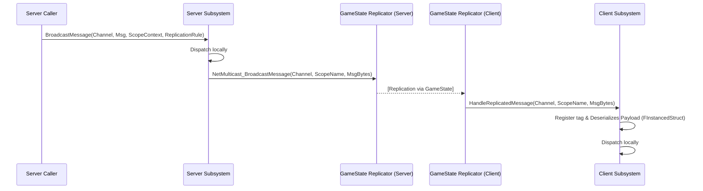

# Scoped Message System - Architecture Guide

This document describes the design and internal architecture of the **Scoped Message System (SMS)**.

---

## 1. Overview & Core Concept
In multiplayer Unreal Engine projects, standard global event routers (e.g. GameplayMessageRouter) suffer from message crosstalk when multiple homogeneous sub-areas (e.g. camps, level instances, or instanced rooms) coexist. 

SMS addresses this by introducing a **Scope Context** parameter (as a `FGameplayTag` identifier) to isolate messages within logical boundaries.

```
                  +----------------------------------+
                  |    UScopedMessageSubsystem       |
                  +----------------------------------+
                                    |
            +-----------------------+-----------------------+
            | (Key: ScopeId = Scope.Camp.Blue)              | (Key: ScopeId = EmptyTag)
            v                                               v
+-----------------------+                       +-----------------------+
|   FScopeChannelMap    |                       |   FScopeChannelMap    |
+-----------------------+                       +-----------------------+
| Key: Channel          |                       | Key: Channel          |
| -> FListenerList      |                       | -> FListenerList      |
+-----------------------+                       +-----------------------+
```

---

## 2. Core Components

### 2.1 UScopedMessageSubsystem (GameInstance Subsystem)
- **Role**: The central broker managing local message subscriptions and routing.
- **Routing Table**: Dual-key mapping structured as `TMap<FGameplayTag, FScopeChannelMap>` (where the first key is the `ScopeId` and the second key is the channel `Channel`).
- **Dynamic Tag Generation**: Automatically generates unique, sanitized tags (e.g. `Scope.AutoGenerated.<ClassName>_<Hash>`) for scope providers that do not configure one manually.

### 2.2 IScopeContextProvider (C++ Interface)
- **Role**: Allows any `UObject` to act as a message boundary.
- **Contract**: Exposes a `GetScopeId()` virtual function.
- **Resolution Algorithm**:
  If a message is broadcast/listened to without a specified scope context, the subsystem crawls up the caller's `Outer` chain (e.g. `Actor -> Level -> LevelInstance -> World`) and the physical attachment parent hierarchy to find the closest object implementing `IScopeContextProvider`. The worst-case lookup is $O(d)$ where $d$ is hierarchy depth ($\approx 5$ steps, executing in $O(1)$ time).

### 2.3 UScopedMessageReplicatorComponent (Replication Bridge)
- **Role**: Replicates scoped messages across the server-client boundary.
- **Dynamic Attachment**: Dynamically spawned and attached to the `AGameStateBase` at startup. This guarantees `bAlwaysRelevant` behavior without LOD/culling issues.
- **Network Safety**: Bypasses the default `FGameplayTag` network index table (which causes mismatches when tags are dynamically registered at runtime on the server). Dynamic tags are transmitted as `FName` and registered on clients using `AddNativeGameplayTag`.

### 2.4 UAsyncAction_ListenForScopedMessage (Blueprint Async Node)
- **Role**: Exposes asynchronous event listening to Blueprints.
- **Memory Safety**: Uses RAII to automatically unregister subscription handles from the subsystem when the node is canceled or the calling blueprint object is garbage collected.

---

## 3. Network Replication Flow



