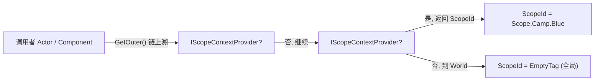
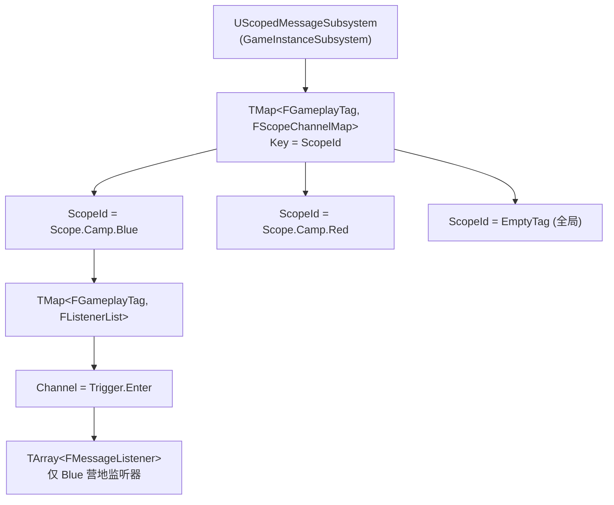
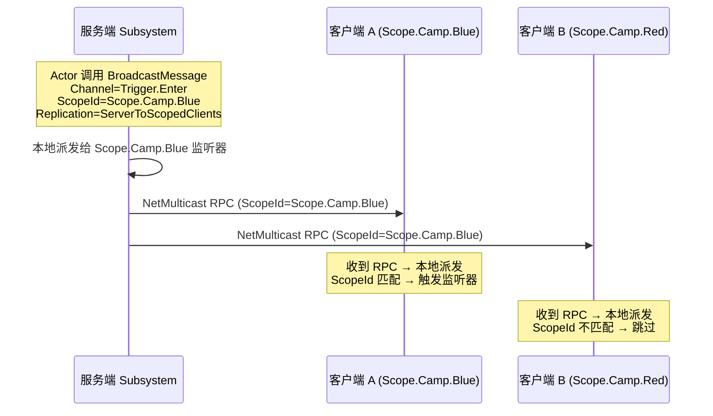

# 局域作用域消息系统 (Scoped Message System) 技术设计方案

## 概述

在大型 UE 项目中，当关卡内同时存在多个同构子区域（如多个营地、多个房间、多个副本实例）时，基于 GameplayMessageRouter 的全局广播机制会导致消息串扰——A 区域的"门开了"事件会触发 B 区域所有监听器，迫使每个接收端手动编写区域 ID 过滤逻辑。

本方案设计一个**通用、接口驱动、网络可同步**的局域作用域消息系统，在消息层引入"作用域上下文 (Scope Context)"，实现局部事件的零判定自动隔离派发。

---

## 1. 核心设计思想

### 1.1 作用域上下文 (Scope Context)

每条消息绑定一个 `FGameplayTag` 类型的 **ScopeId**，标识消息所属的逻辑区域。

| 场景 | ScopeId 示例 | 说明 |
|:---|:---|:---|
| 局部作用域 | `Scope.Camp.Blue` | 仅 Blue 营地内的监听器收到 |
| 局部作用域（层级） | `Scope.Dungeon.Floor1.Room3` | 利用 GameplayTag 层级，可精确或模糊匹配 |
| 全局作用域 | `FGameplayTag::EmptyTag` | 降级为全局广播，兼容现有 GameplayMessage 行为 |

### 1.2 接口驱动的 Scope 提供者

任何 `UObject` 可实现 `IScopeContextProvider` 接口来声明自己是作用域边界。系统通过遍历 Outer 链（而非遍历 Actor 列表）查找 Scope，时间复杂度 O(depth) ≈ O(1)。



### 1.3 自动 Scope 追溯 (Zero-Code Context)

当调用者未显式传入 Scope 时，系统自动沿 Outer 链上溯查找 `IScopeContextProvider`：

```
调用者 Actor → GetOuter() → Level → GetOuter() → LevelInstance → ... → World
                                                    ↑
                                          若实现了 IScopeContextProvider
                                          则返回其 GetScopeId()
```

策划在蓝图中无需手动指定 Scope——将 `Scope Context` 引脚留空（或默认 `Self`），系统自动解析。

---

## 2. 系统架构设计

### 2.1 双层路由模型

Subsystem 内部以 `ScopeId (FGameplayTag)` 为第一级键、`Channel (FGameplayTag)` 为第二级键，建立双层映射表：



### 2.2 内存安全

- Scope 键使用 `FGameplayTag`（值类型），无悬空引用风险
- Listener 中持有 `TWeakObjectPtr<UObject>` 指向订阅者，订阅者销毁后自动跳过
- 提供 `CleanupInvalidListeners()` 定期清理，也可在每次广播前惰性清理

### 2.3 模块结构

```
ScopedMessageSystem (Runtime 模块)
├── Public/
│   ├── ScopedMessageSubsystem.h          # 核心子系统
│   ├── ScopedMessageTypes.h              # 句柄、监听器数据结构
│   └── ScopeContextProvider.h            # IScopeContextProvider 接口
└── Private/
    ├── ScopedMessageSubsystem.cpp
    └── ScopedMessageTypes.cpp

ScopedMessageNodes (UncookedOnly 模块, 可选)
└── Private/
    └── K2Node_WaitForScopedMessage.cpp   # 蓝图异步节点
```

---

## 3. C++ 接口设计

### 3.1 IScopeContextProvider 接口

```cpp
#pragma once

#include "CoreMinimal.h"
#include "GameplayTagContainer.h"
#include "UObject/Interface.h"
#include "ScopeContextProvider.generated.h"

UINTERFACE(MinimalAPI, BlueprintType, meta = (CannotImplementInterfaceInBlueprint))
class UScopeContextProvider : public UInterface
{
    GENERATED_BODY()
};

/**
 * 实现此接口的对象可作为一个消息作用域边界。
 * 典型实现者：关卡实例、子关卡根 Actor、区域管理器等。
 */
class SCOPEDMESSAGESYSTEM_API IScopeContextProvider
{
    GENERATED_BODY()

public:
    /** 返回此对象代表的作用域标识。EmptyTag 表示不提供作用域（继续上溯）。 */
    virtual FGameplayTag GetScopeId() const = 0;
};
```

### 3.2 消息句柄与监听器数据

```cpp
#pragma once

#include "CoreMinimal.h"
#include "GameplayTagContainer.h"
#include "ScopedMessageTypes.generated.h"

class UScopedMessageSubsystem;

UENUM(BlueprintType)
enum class EScopedMessageMatch : uint8
{
    ExactMatch   UMETA(DisplayName = "精确匹配"),
    PartialMatch UMETA(DisplayName = "部分匹配（含子级）")
};

USTRUCT(BlueprintType)
struct SCOPEDMESSAGESYSTEM_API FScopedMessageListenerHandle
{
    GENERATED_BODY()

public:
    FScopedMessageListenerHandle() = default;

    void Unregister();

    bool IsValid() const { return HandleID != 0; }

private:
    friend class UScopedMessageSubsystem;

    UPROPERTY(Transient)
    TWeakObjectPtr<UScopedMessageSubsystem> Subsystem;

    UPROPERTY(Transient)
    FGameplayTag ScopeId;

    UPROPERTY(Transient)
    FGameplayTag Channel;

    UPROPERTY(Transient)
    int32 HandleID = 0;

    FScopedMessageListenerHandle(UScopedMessageSubsystem* InSubsystem, FGameplayTag InScopeId, FGameplayTag InChannel, int32 InID)
        : Subsystem(InSubsystem), ScopeId(InScopeId), Channel(InChannel), HandleID(InID) {}
};

USTRUCT()
struct FScopedMessageListenerData
{
    GENERATED_BODY()

    TFunction<void(FGameplayTag Channel, const UScriptStruct*, const void*)> Callback;

    int32 HandleID = 0;
    EScopedMessageMatch MatchType = EScopedMessageMatch::ExactMatch;
    TWeakObjectPtr<UObject> Owner;
    TWeakObjectPtr<const UScriptStruct> PayloadType;
};
```

### 3.3 核心子系统

```cpp
#pragma once

#include "CoreMinimal.h"
#include "GameplayTagContainer.h"
#include "Subsystems/GameInstanceSubsystem.h"
#include "ScopedMessageTypes.h"
#include "ScopedMessageSubsystem.generated.h"

UENUM(BlueprintType)
enum class EScopedMessageReplication : uint8
{
    /** 仅在当前端广播，不涉及网络 */
    LocalOnly,

    /** 服务端广播后通过多播 RPC 同步到所有客户端 */
    ServerToAllClients,

    /** 服务端广播后仅同步到 Scope 相关的客户端（基于 ScopeId 的 Net Relevancy） */
    ServerToScopedClients
};

UCLASS(MinimalAPI, DisplayName = "Scoped Message Subsystem")
class SCOPEDMESSAGESYSTEM_API UScopedMessageSubsystem : public UGameInstanceSubsystem
{
    GENERATED_BODY()

public:
    static UScopedMessageSubsystem& Get(const UObject* WorldContextObject);
    static bool HasInstance(const UObject* WorldContextObject);

    //~ Begin USubsystem
    virtual void Deinitialize() override;
    //~ End USubsystem

    // ========== 广播 ==========

    /**
     * 向指定 Scope 广播消息
     * @param Channel       消息频道
     * @param Message       消息载荷
     * @param ScopeContext  作用域对象；若为空则自动沿 Outer 链上溯查找 IScopeContextProvider
     * @param Replication   网络复制策略（默认仅本地）
     */
    template <typename FMessageStruct>
    void BroadcastMessage(
        FGameplayTag Channel,
        const FMessageStruct& Message,
        UObject* ScopeContext = nullptr,
        EScopedMessageReplication Replication = EScopedMessageReplication::LocalOnly);

    // ========== 订阅 ==========

    /** Lambda 订阅 */
    template <typename FMessageStruct>
    FScopedMessageListenerHandle Subscribe(
        FGameplayTag Channel,
        TFunction<void(FGameplayTag, const FMessageStruct&)> Callback,
        UObject* ScopeContext = nullptr,
        EScopedMessageMatch MatchType = EScopedMessageMatch::ExactMatch);

    /** 成员函数订阅（带弱引用安全检查） */
    template <typename FMessageStruct, typename TOwner>
    FScopedMessageListenerHandle Subscribe(
        FGameplayTag Channel,
        TOwner* Object,
        void (TOwner::*Function)(FGameplayTag, const FMessageStruct&),
        UObject* ScopeContext = nullptr,
        EScopedMessageMatch MatchType = EScopedMessageMatch::ExactMatch);

    // ========== 注销 ==========

    void Unsubscribe(FScopedMessageListenerHandle& Handle);

    // ========== 蓝图接口 ==========

    UFUNCTION(BlueprintCallable, CustomThunk, Category = "Scoped Message",
        meta = (CustomStructureParam = "Message", AllowAbstract = "false", DisplayName = "Broadcast Scoped Message"))
    void K2_BroadcastMessage(
        FGameplayTag Channel,
        const int32& Message,
        UObject* ScopeContext = nullptr,
        EScopedMessageReplication Replication = EScopedMessageReplication::LocalOnly);

    DECLARE_FUNCTION(execK2_BroadcastMessage);

protected:
    /** 解析 ScopeId：若 ScopeContext 为空则沿 Outer 链查找 IScopeContextProvider */
    FGameplayTag ResolveScopeId(UObject* ScopeContext) const;

private:
    void BroadcastMessageInternal(
        FGameplayTag Channel,
        const UScriptStruct* PayloadType,
        const void* PayloadBytes,
        FGameplayTag ScopeId,
        EScopedMessageReplication Replication);

    FScopedMessageListenerHandle SubscribeInternal(
        FGameplayTag Channel,
        TFunction<void(FGameplayTag, const UScriptStruct*, const void*)>&& Callback,
        const UScriptStruct* PayloadType,
        FGameplayTag ScopeId,
        EScopedMessageMatch MatchType,
        UObject* Owner);

    void UnsubscribeInternal(FGameplayTag ScopeId, FGameplayTag Channel, int32 HandleID);

    // ========== 网络 ==========

    UFUNCTION(NetMulticast, Reliable)
    void NetMulticast_BroadcastMessage(
        FGameplayTag Channel,
        FGameplayTag ScopeId,
        const UScriptStruct* PayloadType,
        const TArray<uint8>& PayloadBytes);

    // ========== 内部数据结构 ==========

    struct FListenerList
    {
        TArray<FScopedMessageListenerData> Listeners;
        int32 NextHandleID = 1;
    };

    struct FScopeChannelMap
    {
        TMap<FGameplayTag, FListenerList> ChannelMap;
    };

    TMap<FGameplayTag, FScopeChannelMap> RoutingTable;

    // 用于网络序列化的 Payload 缓存
    static TArray<uint8> SerializationBuffer;
};
```

### 3.4 Scope 解析算法

```cpp
FGameplayTag UScopedMessageSubsystem::ResolveScopeId(UObject* ScopeContext) const
{
    // 1. 显式传入 → 直接使用
    if (ScopeContext)
    {
        if (IScopeContextProvider* Provider = Cast<IScopeContextProvider>(ScopeContext))
        {
            const FGameplayTag Tag = Provider->GetScopeId();
            if (Tag.IsValid())
            {
                return Tag;
            }
        }
        // 传入的对象未实现接口 → 尝试沿其 Outer 链查找
    }

    // 2. 未传入 → 从调用上下文获取（蓝图端由 K2Node 注入 Self）
    //    此处 ScopeContext 为 nullptr，需由调用方传入 WorldContext
    //    实际使用中，蓝图节点会将 Self 作为 ScopeContext 传入

    if (!ScopeContext)
    {
        return FGameplayTag::EmptyTag; // 全局作用域
    }

    // 3. 沿 Outer 链上溯查找 IScopeContextProvider
    UObject* Current = ScopeContext;
    while (Current)
    {
        if (IScopeContextProvider* Provider = Cast<IScopeContextProvider>(Current))
        {
            const FGameplayTag Tag = Provider->GetScopeId();
            if (Tag.IsValid())
            {
                return Tag;
            }
        }
        Current = Current->GetOuter();
    }

    // 4. 兜底：全局作用域
    return FGameplayTag::EmptyTag;
}
```

**复杂度**：Outer 链深度通常为 3~5（Actor → Level → LevelInstance → World），O(1) 级别，无遍历。

---

## 4. 网络同步设计

### 4.1 复制策略

| 策略 | 行为 | 适用场景 |
|:---|:---|:---|
| `LocalOnly` | 仅当前进程内派发，不走网络 | 纯客户端表现（UI、音效、VFX） |
| `ServerToAllClients` | 服务端广播 → NetMulticast RPC → 所有客户端本地派发 | 全局状态变更（如游戏阶段切换） |
| `ServerToScopedClients` | 服务端广播 → 仅 Scope 相关客户端收到 | 区域事件（如"Blue 营地门开了"） |

### 4.2 网络架构



### 4.3 ScopeId 的网络一致性

- `IScopeContextProvider::GetScopeId()` 返回的 `FGameplayTag` 必须在服务端和客户端**一致**
- 推荐做法：ScopeId 由关卡实例的配置数据决定，通过属性复制或关卡流送时同步
- 客户端通过相同的 Outer 链解析逻辑得到相同的 ScopeId

### 4.4 网络带宽优化

- `ServerToScopedClients` 策略下，RPC 仍会到达所有客户端，但客户端本地根据 ScopeId 过滤——避免为每个 Scope 维护独立的客户端列表
- 若需严格按 Scope 分流，可结合 `Iris` 的 `NetObjectGridFilter` 在更底层过滤（后续优化项）

---

## 5. 蓝图节点设计

### 5.1 Wait For Scoped Message（异步等待节点）

基于 `UK2Node_AsyncAction` 开发，参考 GameplayMessageRouter 的 `UAsyncAction_ListenForGameplayMessage`。

```
   ┌──────────────────────────────────────────────┐
   │        Wait For Scoped Message               │
   ├──────────────────────────────────────────────┤
   │  In: Exec ──────────────────► Out: Exec      │
   │  Channel: Trigger.Enter     ► On Message ────│
   │  Payload Struct             ► Payload: (...) │
   │  Scope Context: (Self)      ► Scope Id: Tag  │
   │  Match Type: ExactMatch                      │
   └──────────────────────────────────────────────┘
```

- **Scope Context** 引脚默认值 = `Self`，策划无需手动连线
- 节点在 `Activate()` 时自动调用 `ResolveScopeId(Self)` 确定 ScopeId
- 节点在 `BeginDestroy()` 或显式取消时自动 Unsubscribe

### 5.2 Broadcast Scoped Message（广播节点）

蓝图可直接调用 `K2_BroadcastMessage`，通过 `CustomStructureParam` 支持任意 Payload 结构体。

---

## 6. 典型使用场景

### 6.1 场景：多营地触发器

```
关卡结构：
  World
  ├── Camp_Blue (LevelInstance, 实现 IScopeContextProvider, ScopeId = Scope.Camp.Blue)
  │   ├── BP_Trigger_Door (监听 Trigger.Enter)
  │   └── BP_Terminal (广播 Trigger.Enter)
  └── Camp_Red (LevelInstance, 实现 IScopeContextProvider, ScopeId = Scope.Camp.Red)
      ├── BP_Trigger_Door (监听 Trigger.Enter)
      └── BP_Terminal (广播 Trigger.Enter)
```

**流程**：
1. `BP_Terminal` 在 Camp_Blue 中广播 `Trigger.Enter`，ScopeContext 留空
2. 系统沿 Outer 链上溯找到 Camp_Blue 的 LevelInstance → 获取 `ScopeId = Scope.Camp.Blue`
3. 消息仅路由到 `Scope.Camp.Blue` 下的监听器
4. Camp_Red 的 `BP_Trigger_Door` 完全不受影响

### 6.2 场景：全局 + 局部混合

```cpp
// 全局广播（兼容现有 GameplayMessage 行为）
Subsystem->BroadcastMessage(Tags::Game_StateChanged, Payload);
// ScopeId = EmptyTag → 所有监听器都收到

// 局部广播
Subsystem->BroadcastMessage(Tags::Door_Opened, Payload, CampBlueActor);
// ScopeId = Scope.Camp.Blue → 仅 Blue 营地监听器收到
```

---

## 7. 与 GameplayMessageRouter 的关系

| 维度 | GameplayMessageRouter | ScopedMessageSystem |
|:---|:---|:---|
| 路由模型 | 单层 `Channel → Listeners[]` | 双层 `ScopeId → Channel → Listeners[]` |
| 作用域 | 全局 | 局域隔离 + 全局兼容 |
| Scope 解析 | 无 | 接口驱动，Outer 链上溯 O(1) |
| 网络同步 | 无内置支持 | 三种复制策略 |
| 蓝图支持 | `ListenForGameplayMessage` | `Wait For Scoped Message` |

**并存策略**：ScopedMessageSystem 不替代 GameplayMessageRouter。全局消息继续使用 GameplayMessageRouter；需要局域隔离的场景使用 ScopedMessageSystem。两者可共存于同一项目。

---

## 8. 性能分析

| 指标 | GameplayMessageRouter（全局） | ScopedMessageSystem（局域） |
|:---|:---|:---|
| 广播复杂度 | O(L) — 遍历频道所有监听器 | O(1) — 直接定位 Scope → Channel |
| 内存开销 | 单层 Map | 双层 Map，Scope 数量 × 常数 |
| Scope 解析 | 无 | O(depth) ≈ O(1)，沿 Outer 链上溯 |
| 无效分发 | 所有同频道监听器均被触发 | 仅目标 Scope 内监听器被触发 |

---

## 9. 实施路线

| 阶段 | 内容 | 依赖 |
|:---|:---|:---|
| **Phase 1** | 实现 `IScopeContextProvider` 接口 + `UScopedMessageSubsystem` 核心路由 | GameplayTags |
| **Phase 2** | 实现蓝图节点 `Wait For Scoped Message` + `K2_BroadcastMessage` | Phase 1 |
| **Phase 3** | 实现网络复制（`ServerToAllClients` / `ServerToScopedClients`） | Phase 1 |
| **Phase 4** | 单元测试 + 压力测试（100 Scope × 50 Channel × 10 Listener） | Phase 1-3 |

---

## 10. 附录：关键设计决策记录

| 决策 | 选择 | 理由 |
|:---|:---|:---|
| Scope 标识类型 | `FGameplayTag` | 值类型无悬空风险；支持层级匹配；与 Channel 类型一致 |
| Scope 解析方式 | Outer 链上溯 + 接口 | O(1) 复杂度；不依赖类名字符串；不遍历 Actor 列表 |
| 网络模型 | 服务端权威 + NetMulticast RPC | 简单可靠；客户端本地按 ScopeId 过滤 |
| 与 GameplayMessageRouter 关系 | 并存 | 不破坏现有系统；各司其职 |
| 蓝图 Scope 默认值 | Self | 零配置，策划无需手动连线 |
